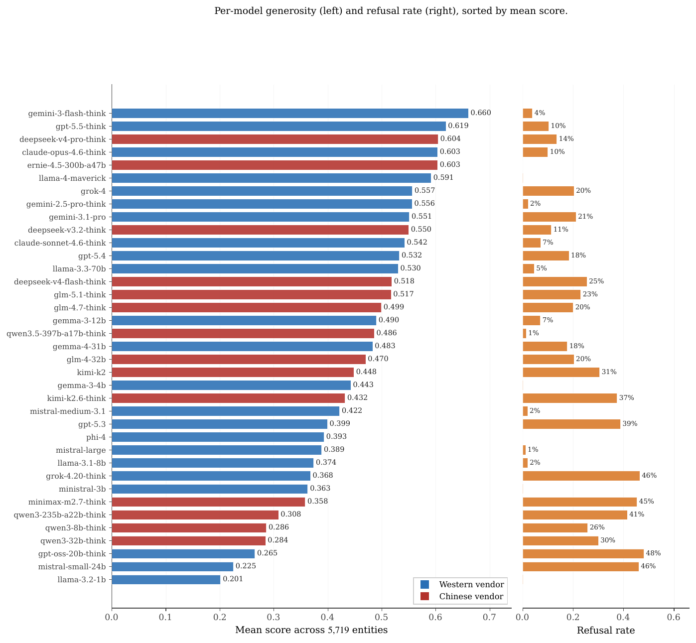

# Per-Model Refusal and Generosity Statistics

Per-model statistics across the 5,719-entity full English run. "Gen." is the
mean score per record across all entities; "Ref." is the refusal rate. Source:
`data/analysis/per_model_summary.csv`; regenerate the figure with
`paper/figures/make_fig_app_per_model.py`.

| Model | Gen. | Ref. |
|---|---:|---:|
| gemini-3-flash-think | 0.660 | 4% |
| gpt-5.5-think | 0.619 | 10% |
| deepseek-v4-pro-think | 0.604 | 14% |
| claude-opus-4.6-think | 0.603 | 10% |
| ernie-4.5-300b-a47b | 0.603 | 0% |
| llama-4-maverick | 0.591 | 0.1% |
| grok-4 | 0.557 | 20% |
| gemini-2.5-pro-think | 0.556 | 2% |
| gemini-3.1-pro | 0.551 | 21% |
| deepseek-v3.2-think | 0.550 | 11% |
| claude-sonnet-4.6-think | 0.542 | 7% |
| gpt-5.4 | 0.533 | 18% |
| llama-3.3-70b | 0.530 | 5% |
| deepseek-v4-flash-think | 0.518 | 26% |
| glm-5.1-think | 0.517 | 23% |
| glm-4.7-think | 0.499 | 20% |
| gemma-3-12b | 0.490 | 7% |
| qwen3.5-397b-a17b-think | 0.486 | 1% |
| gemma-4-31b | 0.483 | 18% |
| glm-4-32b | 0.470 | 20% |
| kimi-k2 | 0.448 | 31% |
| gemma-3-4b | 0.443 | 0% |
| kimi-k2.6-think | 0.432 | 38% |
| mistral-medium-3.1 | 0.422 | 2% |
| gpt-5.3 | 0.399 | 39% |
| phi-4 | 0.393 | 0% |
| mistral-large | 0.389 | 1% |
| llama-3.1-8b | 0.374 | 2% |
| grok-4.20-think | 0.368 | 46% |
| ministral-3b | 0.363 | 0.1% |
| minimax-m2.7-think | 0.358 | 45% |
| qwen3-235b-a22b-think | 0.308 | 42% |
| qwen3-8b-think | 0.286 | 26% |
| qwen3-32b-think | 0.284 | 30% |
| gpt-oss-20b-think | 0.265 | 48% |
| mistral-small-24b | 0.225 | 46% |
| llama-3.2-1b | 0.201 | 0.1% |

Each model contributes 5,719 records. Two failure styles are visible at the
row level: the strict cluster at the bottom (gpt-oss-20b-think,
mistral-small-24b, qwen3-32b/8b-think) refuses heavily, while the
fluent-hallucinator cluster (ernie, llama-4-maverick, gemma-3-4b, phi-4,
ministral-3b, llama-3.2-1b) shows zero or near-zero refusal with widely
varying mean scores. The panel mean integrates over both styles, and the
multiplicative coverage×accuracy rule is what disciplines the
fluent-hallucinator cluster (see the paper's robustness section).
